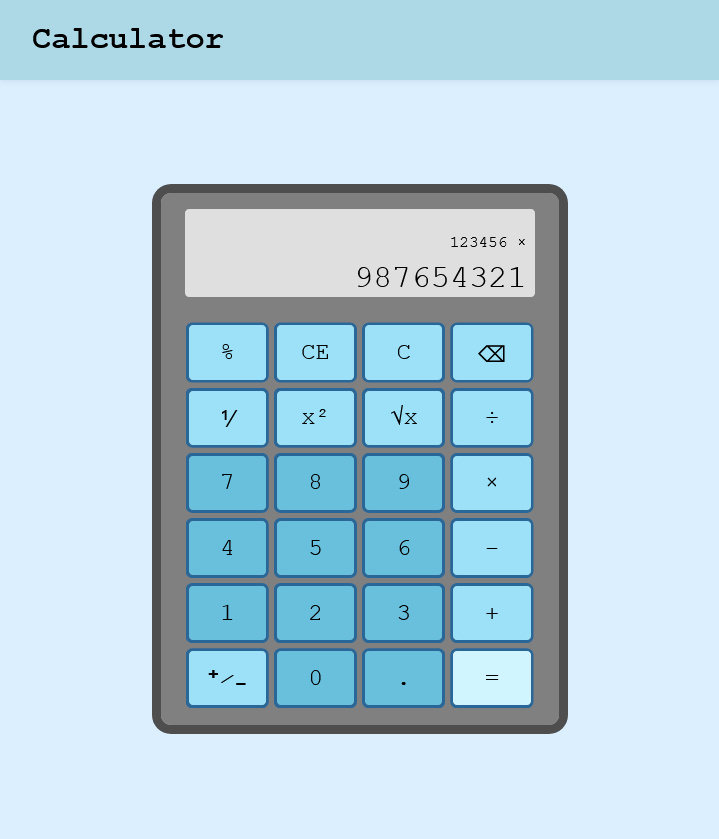

# Calculator

Simple calculator written in HTML, JS and CSS.

You can input by tapping the buttons or by using your keyboard.

Created as part of [The Odin Project course](https://www.theodinproject.com/).